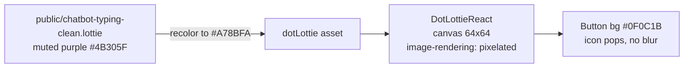

## Plan: Boost Lottie Icon Contrast

The floating chatbot button shows `chatbot-typing-clean.lottie` rendered through `<DotLottieReact>`. On desktop the icon reads as washed-out / low contrast because the asset is drawn in a muted purple (`≈ #4B305F` range) directly against the dark `#0F0C1B` button background — there's barely any luminance gap, so the strokes look soft and "blurred".

**Steps**

1. **Confirm the muted palette is in the asset** — already verified: top-level `comp_0` layers ship with one base purple used for every stroke/fill. The composition is 600×600, FPS 300, op 1800; a single purple swatch is duplicated across all shape groups.
2. **Rework the asset's colors** by editing `public/chatbot-typing-clean.lottie`:
   - Unzip → modify `animations/ced26c9f-18cb-4755-936a-ae546219017d.json` (use Python/json to bump every `c.k` from the current purple to a brighter `~#A78BFA` / `#C4B5FD` so it pops on `#0F0C1B`).
   - Re-zip into a new `chatbot-typing-clean.lottie` (same internal layout: `manifest.json` + `animations/<uuid>.json`) and replace the existing file in `public/`.
3. **Tighten the React wrapper** in `src/components/ChatBot.tsx` so the canvas itself renders crisp:
   - Replace the lone `style={{ width: "100%", height: "100%" }}` with explicit `width`, `height`, and a CSS `className` that adds `image-rendering: pixelated` (won't change vector strokes, but keeps `dotlottie` from falling back to its 300×150 intrinsic canvas — see the long comment at L306–L319).
   - Pin the canvas size to the button's true desktop size (`64px`) by adding `data-dotlottie-size="64"` or, simpler, set explicit `width: 64, height: 64` so the renderer allocates a higher-resolution backing store on desktop.
4. **Verify** by rebuilding (`npm run build`) and running `npm run preview`, opening the desktop view at ≥1024px, and confirming the lottie strokes are sharp and clearly visible against `#0F0C1B`. If the visual is still too dim, bump the color one stop lighter and re-test.

**Relevant files**

- `public/chatbot-typing-clean.lottie` — recolor strokes/fills brighter (`~#A78BFA`).
- `src/components/ChatBot.tsx` — lines 320–330: give `<DotLottieReact>` an explicit pixel-sized canvas and `image-rendering: pixelated` class to keep it crisp.

**Diagrams**

**Verification**

1. `npm run build` succeeds (no asset warnings).
2. Desktop preview at 1280×800: icon strokes are sharp and clearly readable against the button.
3. Mobile preview at 375px: still legible (no regressions from the resize).
4. `diff` against the previous lottie shows only `c.k` color changes — animation timing unchanged.
